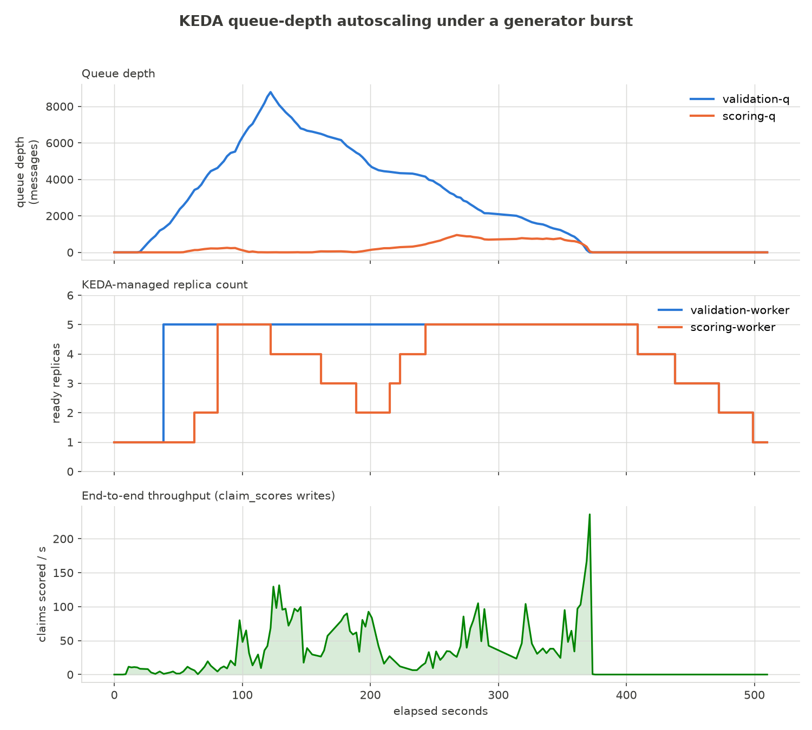
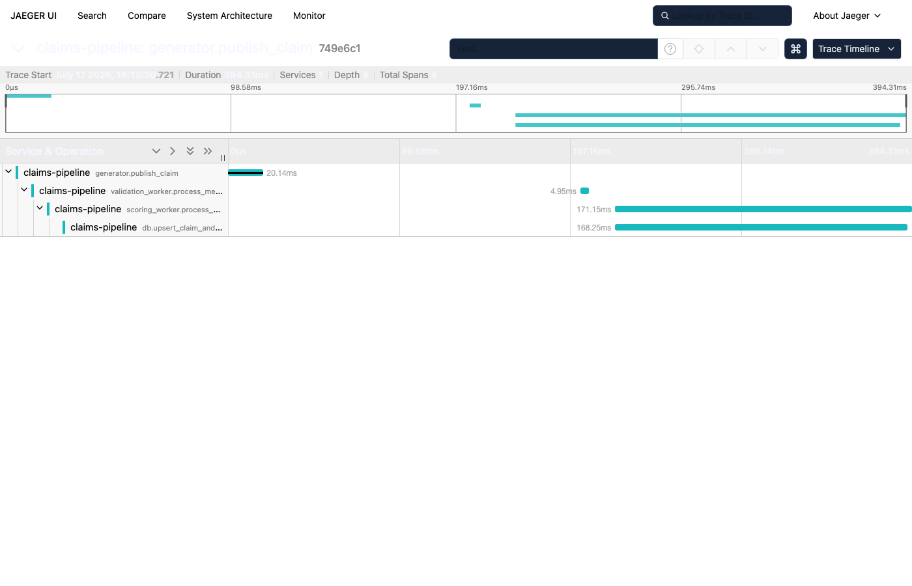

# Event-Driven Claims Processing Platform

*(repo: `claims-pipeline`)*

An event-driven platform that ingests a high-volume stream of synthetic **claim
events**, validates and scores them through a fan-out of asynchronous workers, and
serves a deterministic **provider ranking** over the results. Workers autoscale on
queue depth, unprocessable messages are dead-lettered and replayable, and every
consumer is idempotent so redelivery and replay are safe.

This repository demonstrates scalable event-driven architecture, not healthcare
expertise. Synthetic claims are used solely to exercise distributed-systems concerns:
asynchronous processing, fan-out, queue-depth autoscaling, idempotency, retries and
dead-letter recovery, observability, and deterministic business logic. The scoring
rule is deliberately simple so it can be verified by hand and used as a test oracle.
A language model appears only as a carefully constrained component at one endpoint —
it explains a ranking, it never computes one (ADR-0003).

## Architecture

```
        synthetic claim events
                 │
                 ▼
          SNS topic  (claims-raw)
                 │  fan-out
                 ▼                                      ┌─────────────────┐
          SQS (validation-q) ───► Validation worker     │   KEDA          │
                 │                       │ valid        │     ▲           │
   invalid ──────┘                       ▼              │     │ scales on │
   ▼                              SQS (scoring-q) ─────►│   queue depth   │
 SQS (validation-dlq)                    │              └─────────────────┘
                                         ▼
                                   Scoring worker ──► PostgreSQL
                                                       (claim_scores,
                                                        provider_scores)
                                                          │
                                                          ▼
                                                    Ranking API
                                                     ├─ GET /providers/ranking
                                                     └─ GET /providers/{id}/explanation
                                                            (confined LLM)
```

Runs locally end-to-end on LocalStack + Postgres via docker-compose; deploys to EKS
with KEDA scaling workers on SQS queue depth.

**The autoscaling, proven on a real run** (kind + real KEDA, ADR-0004, ADR-0014): a
generator burst drives `validation-q` depth to a peak of 8,782 messages, both worker
Deployments scale from 1 to 5 replicas, the backlog drains, and replica counts step
back down to 1 as each queue empties.



Full numbers and reproduction steps: `benchmark/reports/session7_load_test_report.md`.
A distributed trace of one claim's SNS→SQS→validation→scoring→Postgres path, captured
from a real OpenTelemetry/Jaeger run:



**Deployment surface (ADR-0008, ADR-0013):** the same container image and application
code run at every stage below — only configuration (an endpoint URL, a region, a
secret's value) changes between them.

```
LocalStack + host processes  →  real local Kubernetes (kind)  →  EKS (Terraform artifact)
   Sessions 1-5, docker-compose      infra/k8s/, this session       infra/eks/, not applied
```

The kind stage is validated by actually running it: pods come up healthy, the
generator publishes, the in-cluster workers consume and score, and the ranking API
serves reads through a NodePort — see `infra/k8s/README.md`. The EKS stage is a
reviewable Terraform artifact (`SNS`/`SQS`/DLQs mirroring `infra/local/provision.sh`,
least-privilege IRSA per workload, RDS for Postgres) that `terraform validate` and
`fmt -check` pass; it is not applied against a live account — see `infra/eks/README.md`
and ADR-0013 for why, and for the scoping decisions flagged along the way (existing
cluster assumed rather than provisioned, RDS vs. in-cluster Postgres, state backend).

## Failure scenario

The system is designed around what happens when processing goes wrong, not only when
it goes right. Two failure classes exist, and they are kept conceptually and
mechanically distinct (`docs/SPEC.md` §5, ADR-0007, ADR-0010):

- **Business-invalid.** A claim decodes fine but fails an `events.validate` rule
  (e.g. `allowed_amount > billed_amount`). The validation worker routes it directly
  to `validation-dlq` with a structured reason it authors itself — this is not a
  redrive, and it's never scored.
- **Poison / processing failure.** A message that fails to even decode, or that
  raises unexpectedly mid-process (a bug, a transient downstream outage). This is
  where SQS's own redrive policy does the work:

  1. A worker fails on a message and does **not** delete it (ack discipline, not a
     hand-rolled retry loop).
  2. The message's visibility timeout expires and SQS redelivers it.
  3. Redelivery repeats up to `maxReceiveCount = 3` (ADR-0010).
  4. On exceeding that count, SQS itself redrives the message to the matching
     dead-letter queue — `validation-q` → `validation-dlq`, `scoring-q` →
     `scoring-dlq` — with no application-level backoff involved.
  5. An operator inspects the dead-letter queue (`python -m claims_pipeline.replay
     --dlq <name> --dry-run`) and, once the cause is addressed, replays the message
     back onto the source queue (`python -m claims_pipeline.replay --dlq <name>
     --source-queue <queue>`).
  6. Because every consumer is **idempotent on `claim_id`**, replay cannot
     double-count a claim into a provider's aggregate — reprocessing converges to
     the same state. (A genuinely undecodable body has no corrected form to
     replay byte-for-byte; the dry-run inspection is what surfaces it for a human
     to address at the source, not a guarantee that replay alone repairs it.)

This is why idempotency is a hard invariant rather than a nice-to-have: it is what
makes dead-letter replay safe.

## Design stance

- **Deterministic spine, confined model.** The ranking is a pure function of claim
  data. The language model explains the ranking against a fixed set of grounded
  facts and is never in the path that decides order. See ADR-0003.
- **Correctness lives in tests; the model boundary lives in evals.** Scoring,
  ranking, idempotency, and dead-letter behavior are asserted as tests. Explanation
  faithfulness is measured as an eval. See `docs/EVAL_PLAN.md`.
- **Synthetic data only.** No real protected health information ever enters the
  system. Claim events are generated. De-identification is treated as a design
  concern, not a machine-learning problem to be graded. See ADR-0005.

## Engineering decisions

The architecturally significant choices are recorded as ADRs in `docs/adr/`:

- [ADR-0001](docs/adr/0001-event-driven-ingestion.md) — Event-driven ingestion over synchronous REST
- [ADR-0002](docs/adr/0002-sns-fanout-to-sqs.md) — SNS topic fan-out to SQS (and why not Kafka)
- [ADR-0003](docs/adr/0003-deterministic-scoring-confined-llm.md) — Deterministic scoring; language model confined to explanation
- [ADR-0004](docs/adr/0004-keda-queue-depth-autoscaling.md) — KEDA queue-depth autoscaling over CPU-based HPA
- [ADR-0005](docs/adr/0005-synthetic-data-and-de-identification.md) — Synthetic data only; de-identification as a design concern
- [ADR-0006](docs/adr/0006-python-for-workers-and-api.md) — Python for workers and the API
- [ADR-0007](docs/adr/0007-idempotent-consumers.md) — Idempotent consumers via `claim_id`
- [ADR-0008](docs/adr/0008-local-first-then-eks.md) — Local-first on LocalStack, then EKS
- [ADR-0009](docs/adr/0009-raw-sql-schema-no-migration-framework.md) — Raw SQL schema, no migration framework (yet)
- [ADR-0010](docs/adr/0010-sqs-native-redrive-and-visibility-backoff.md) — SQS-native redrive policy; visibility timeout as the only backoff
- [ADR-0011](docs/adr/0011-fastapi-ranking-api-and-two-layer-guardrail-tests.md) — FastAPI for the ranking API; two-layer Tier 2 guardrail tests
- [ADR-0012](docs/adr/0012-tier3-faithfulness-eval-harness.md) — Tier 3 faithfulness eval harness: judge model, baseline, and threshold
- [ADR-0013](docs/adr/0013-kind-for-local-eks-as-artifact.md) — kind for local Kubernetes validation; EKS as a reviewable, unapplied artifact
- [ADR-0014](docs/adr/0014-keda-autoscaling-tuning.md) — KEDA autoscaling tuning: target depth, replica bounds, scale-down pacing
- [ADR-0015](docs/adr/0015-pulumi-for-sns-sqs-iam.md) — Pulumi port of SNS/SQS + IRSA IAM, alongside Terraform

## API surface

Served by FastAPI (`claims_pipeline.api.app:app`, run locally with `uvicorn
claims_pipeline.api.app:app --reload`):

- `GET /providers/ranking?limit=<n>` — the deterministic ranking, a pure read over
  `provider_scores`. Never touches the language model (ADR-0003) — enforced by a
  test that fails if the ranking router ever constructs an Anthropic client.
- `GET /providers/{provider_id}` — single-provider detail: score, sub-signals, rank.
- `GET /providers/{provider_id}/explanation` — the only endpoint that calls the
  model. Assembles a fixed `grounded_facts` envelope (score, sub-signals, rank,
  neighbors) from the same deterministic read, then asks the model to describe it in
  prose. The model never sees anything beyond that envelope, and any claim/provider
  -derived text inside it is treated as untrusted data, not instructions (ADR-0003).

## Scope

Two processing stages (validate, score), not four. The system does not attempt
clinical accuracy, real procedure-code semantics, or reimbursement logic — those
would trade distributed-systems signal for domain surface area (ADR-0005).

Deliberately out of scope for this build, and why each is a *later* decision rather
than a missing feature:

- **Additional processing lanes** (enrichment, audit) — the SNS topic is the seam
  that makes them additive; not building them keeps the pipeline legible (ADR-0002).
- **A replayable ordered log (Kafka/Kinesis)** — appropriate at a throughput and
  ordering profile this system doesn't have; adopting it would be ADR-0002 reversed,
  a new decision (ADR-0002).
- **Production PHI de-identification** — a dedicated component with its own accuracy
  evals; deliberately not staked on here (ADR-0005).
- **Orchestration/transformation tooling and streaming analytics** — downstream of a
  correct pipeline, not part of proving one.

### What was cut across all seven sessions, and why

Scope discipline was itself a deliverable, not just a constraint. In order:

- **Four-worker sprawl, never built.** The pipeline stays at two stages
  (validate, score) the whole way through, even once Kubernetes and
  autoscaling made "just add an enrichment worker" cheap to demonstrate.
  Adding lanes with no real work to do would pad the architecture diagram
  without adding distributed-systems signal — the SNS topic is the proven
  seam (ADR-0002); a third subscriber is additive by construction whenever
  it's actually needed, not before.
- **The de-identification rabbit hole, sidestepped.** Real PHI
  de-identification is an accuracy-graded ML problem with its own eval
  suite — a different project. Synthetic data sidesteps it entirely
  (ADR-0005) so every session's effort went to the distributed-systems
  claims (async processing, fan-out, autoscaling, idempotency, dead-letter
  recovery) this repo actually makes.
- **Kafka/Kinesis, never adopted.** SNS→SQS fan-out was chosen and re-argued
  against a log broker explicitly (ADR-0002) at the start, then never
  revisited under pressure — ordering/replay were never a real requirement
  this system's traffic shape produced, including under Session 7's burst.
- **EKS, documented and reviewed, never applied.** A live EKS control plane
  costs ~$73/month with no production traffic behind it (ADR-0013). Every
  cloud-shaped concern (SNS/SQS/DLQ topology, least-privilege IRSA per
  workload, RDS for Postgres, and now KEDA) is written as reviewable
  Terraform/manifests and validated on **kind** — a real local Kubernetes
  cluster, not a simulation — instead. The autoscaling graphs above are
  captured from that kind run, honestly labeled as such: the mechanism and
  scaler logic are identical on EKS (`infra/eks/README.md`'s KEDA section),
  only the cluster differs.
- **Full production OpenTelemetry instrumentation, deliberately narrowed
  (Session 7).** Threading W3C trace-context propagation through every
  `MessageAttributes` hop inside the worker/publisher modules, plus
  auto-instrumenting boto3/psycopg, would have touched most of the worker
  test suite's mocked-`sqs` call signatures for a session whose budget was
  mostly the KEDA/load-test work. Shipped instead: a standalone script
  (`benchmark/trace_one_claim.py`) that drives the exact same application
  logic (`events.validate`, `repository.upsert_claim_and_recompute`) for one
  real claim, manually wrapped in OTel spans — a genuine four-span trace of
  real code (screenshot above), without a production-code refactor whose
  payoff this session had no way to validate against real usage.
- **Scale-to-zero (`minReplicaCount: 0`), not used this session.** Real KEDA
  capability, arguably a better fit for a genuinely bursty workload — set
  aside so the load-test graphs don't have to explain a cold-start gap at
  t=0 (ADR-0014). A real tuning candidate for whoever picks up ADR-0014's
  flagged values next.

## Repository layout

```
docs/
  SPEC.md            # event contract, pipeline stages, scoring contract, API contract, load generator
  EVAL_PLAN.md       # tests-vs-evals split, the improvement loop, CI gates
  adr/               # architecture decision records
AGENTS.md            # build conventions and the human/agent division of labor
benchmark/
  golden.seed.jsonl        # hand-verified claim → score cases (the Tier 1 oracle seed)
  faithfulness.eval.jsonl  # grounded_facts cases for the Tier 3 faithfulness harness (ADR-0012)
  monitor_scaling.py       # Session 7: samples queue depth/replicas/throughput during a load test
  plot_scaling.py          # Session 7: renders the sampled CSV into docs/images/ graphs
  trace_one_claim.py       # Session 7: one-claim OTel trace demo (see README's Scope section)
  reports/                 # Tier 3 report + baseline (ADR-0012); Session 7 load-test report + CSV
docs/images/         # committed graphs and the trace waterfall screenshot (Session 7)
infra/local/         # docker-compose rig (LocalStack + Postgres) and provisioning script
infra/k8s/           # kind cluster config, manifests, KEDA ScaledObjects (ADR-0014), and runbook
infra/eks/           # EKS Terraform artifact (SNS/SQS/DLQs, IRSA IAM, RDS) -- not applied
infra/pulumi/        # Pulumi Python port of SNS/SQS + IRSA IAM (ADR-0015) -- not applied
Dockerfile           # shared image for the API and both workers (infra/k8s/README.md)
src/claims_pipeline/
  events.py          # the claim event contract (SPEC.md §1)
  generator/         # deterministic synthetic claim load generator (SPEC.md §6, burst: ADR-0014)
  scoring.py         # the pure scoring/ranking core (SPEC.md §3, ADR-0003)
  db/                # Postgres persistence: schema.sql, repository.py (ADR-0007, ADR-0009)
  workers/           # validation and scoring workers; ack discipline (SPEC.md §2, §5, ADR-0010)
  replay/            # dead-letter inspection and replay CLI (SPEC.md §5, ADR-0007)
  api/               # FastAPI ranking API: routers, dependencies, schemas (SPEC.md §4, ADR-0011)
  explanation/       # the confined explanation layer -- the only model call (SPEC.md §4, ADR-0003)
  evals/             # Tier 3 faithfulness eval harness: judge, runner, CLI (EVAL_PLAN.md, ADR-0012)
tests/               # unit tests, golden-seed scoring tests, and LocalStack/Postgres
                     # integration tests (real service containers in CI; skip
                     # locally if that infra isn't reachable)
```

## Running the Tier 3 faithfulness eval harness

```sh
python -m claims_pipeline.evals                    # run + print the report, no gating
python -m claims_pipeline.evals --write-baseline    # record this run's score as the new baseline
python -m claims_pipeline.evals --check-baseline    # exit non-zero only on regression below baseline
```

Requires `ANTHROPIC_API_KEY` (both the explanation model and the judge are live model
calls); skips cleanly and exits 0 with no key, the same pattern the live guardrail
tests use. The harness logic itself (aggregation, clustering, baseline comparison) is
covered by `tests/evals/test_runner_stubbed.py` with no key required. See ADR-0012
for the judge model, baseline, and threshold this session recorded.

## Status

Local rig in place: the claim event contract, the SNS→SQS provisioning, and a v1
load generator (rate/count/provider distribution/outcome mix/seed) run end-to-end
against LocalStack. The deterministic scoring core, Postgres persistence, and the
validation and scoring workers are built and idempotent on `claim_id`. The
reliability layer is in place: SQS-native redrive policies (`maxReceiveCount=3`,
ADR-0010), correct worker ack discipline, the generator's `failure_injection` knob
(invalid-but-parseable / malformed / duplicate), and the `python -m
claims_pipeline.replay` dead-letter inspection/replay CLI, all exercised end-to-end
against real LocalStack + Postgres. The ranking API and confined explanation
endpoint are built and covered by Tier 1 golden-seed ordering tests and Tier 2
guardrail tests (groundedness, injection resistance, non-empty success, ranking
purity — ADR-0011). Tier 3 faithfulness evals are built: a judged eval set
(`benchmark/faithfulness.eval.jsonl`), an LLM-as-judge harness with a committed
baseline (`docs/adr/0012-*`), and a meta-eval proving the judge catches known-bad
explanations. The full pipeline runs on real local Kubernetes (kind): containerized
API and workers, a documented reachability path to LocalStack/Postgres, resource
limits and liveness/readiness probes, and the existing test suite passing unmodified
against the kind deployment by config alone (`docs/adr/0013-*`, `infra/k8s/README.md`).
An EKS Terraform artifact (`infra/eks/`) mirrors the same SNS/SQS/DLQ topology with
least-privilege IRSA IAM and RDS for Postgres; it validates and formats cleanly but is
not applied against a live account this session.

**Session 7 (final) closes the project out.** KEDA is installed on the kind cluster
and scales both workers on real SQS queue depth (ADR-0004, ADR-0014); the generator's
last deferred knob, `burst` (a step change in publish rate at an offset, SPEC.md §6),
is wired up and is what drives the load test. A real load-test run — 10,100 events,
`--rate 10 --burst-rate 250 --burst-offset 10` — is captured end-to-end: peak
`validation-q` depth 8,782 messages, both worker Deployments scaling 1→5 replicas and
back to 1 as the backlog drains (graph above; full numbers in
`benchmark/reports/session7_load_test_report.md`). A real four-span OpenTelemetry
trace of one claim's SNS→SQS→validation→scoring→Postgres path is captured via a local
Jaeger instance (waterfall above; `benchmark/trace_one_claim.py`, scope narrowed from
full production instrumentation — see the Scope section). The project is
feature-complete against its original plan: every SPEC.md §6 generator knob is built,
every ADR-numbered architectural decision has a corresponding implementation, and the
full pipeline is proven, end to end, on a real (local) Kubernetes cluster under real
autoscaling load.
